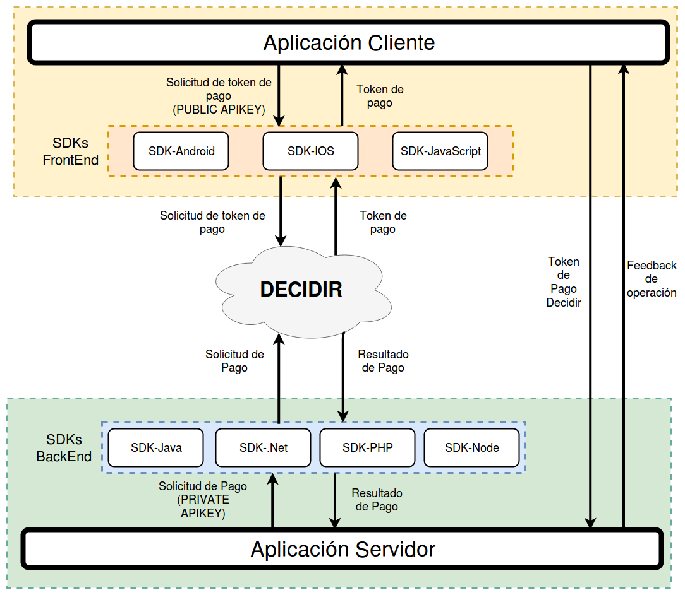
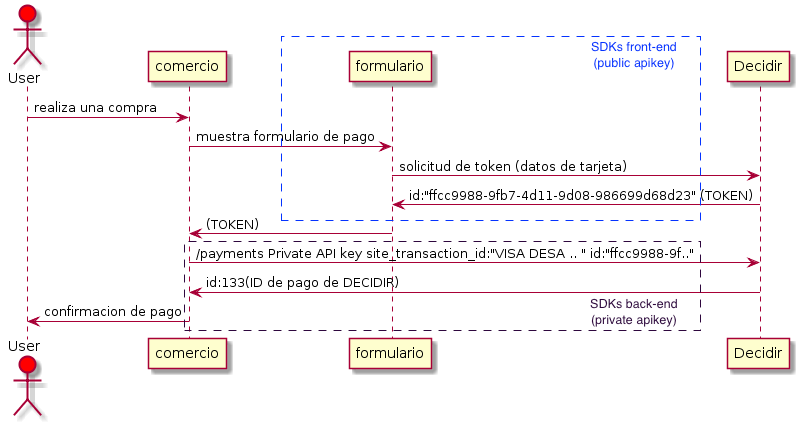
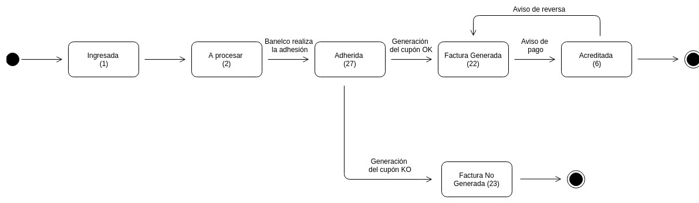
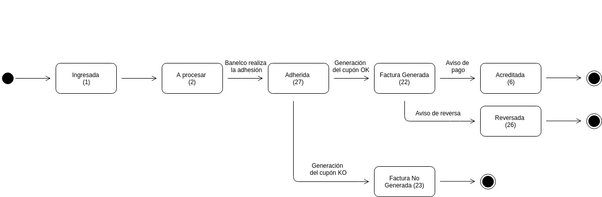
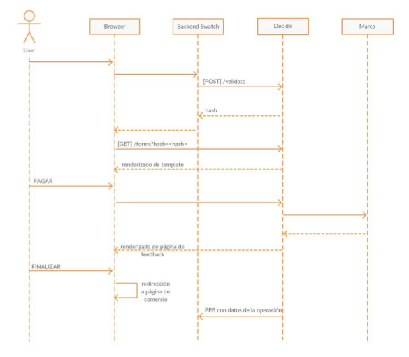
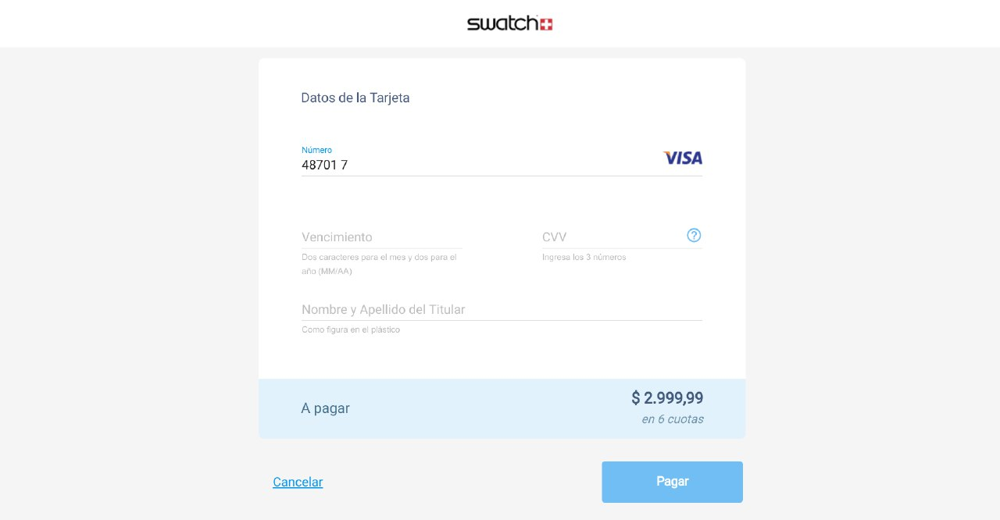

Decidir SDK PHP
===============

Modulo para conexión con gateway de pago DECIDIR2
  + [Introducción](#introduccion)
    + [Alcance](#alcance)
	+ [Cierre de lotes](#cierre)
	+ [TimeOut](#timeout)
    + [Diagrama de secuencia](#diagrama-secuencia)			
  + [Instalación](#instalación)
    + [Versiones de PHP soportadas](#versiones)	
    + [Manual de Integración](#manualintegracion)
    + [Ambiente](#ambiente)
  + [Uso](#uso)
    + [Inicializar la clase correspondiente al conector](#initconector)
    + [Operatoria del Gateway](#operatoria)
      + [Health Check](#healthcheck)
      + [Ejecución del Pago](#payment)
      + [Captura del Pago](#capture)
      + [Ejecución de pago offline](#pagooffline)
        + [Pago Facil](#pf)
        + [Rapipago](#rp)
        + [Pago mis Cuentas](#pmc)
        + [Caja de Pagos](#cp)
        + [Cobro Express](#ce)
      + [Formulario de Pago](#getvalidateform)  
      + [Listado de Pagos](#getallpayments)
      + [Información de un Pago](#getpaymentinfo)	
      	+ [Información adicional de tarjeta](#infoadicionaltarjeta)
      + [Anulación / Devolución Total de Pago](#refund)
      + [Anulación de Devolución Total](#deleterefund)
      + [Devolución Parcial de un Pago](#partialrefund)
      + [Anulación de Devolución Parcial](#deletepartialrefund)
    + [Tokenizacion de tarjetas de crédito](#tokenizaciontarjeta)
      + [Listado de tarjetas tokenizadas](#listadotarjetastokenizadas)	
      + [Ejecucion de pago tokenizado](#pagotokenizado)
      + [Eliminacion de tarjeta tokenizada](#eliminartarjetatokenizada)
    + [Integración con Cybersource](#cybersource)
      + [Retail](#retail)
      + [Ticketing](#ticketing)
      + [Digital Goods](#digital-goods)  
      + [Services](#services)
      + [Travel](#travel)	
  + [Tablas de referencia](#tablasreferencia)
    + [Códigos de Medios de Pago](#códigos-de-medios-de-pago)
	  + [Divisas Aceptadas](#divisasa)
    + [Provincias](#provincias)
  + [Errores](#errores)
    + [Errores de sistema](#erroressistema)
    + [Errores de marca](#erroresmarca)
   
## Introducción
El flujo de una transacción a través de las **sdks** consta de dos pasos, la **generaci&oacute;n de un token de pago** por parte del cliente y el **procesamiento de pago** por parte del comercio. Existen sdks espec&iacute;ficas para realizar estas funciones en distintos lenguajes que se detallan a continuaci&oacute;n:

+ **Generaci&oacute;n de un token de pago.**  Se utiliza alguna de las siguentes **sdks front-end** :
  + [sdk IOS](https://github.com/decidir/SDK-IOS.v2)
  + [sdk Android](https://github.com/decidir/SDK-Android.v2)
  + [sdk Javascript](https://github.com/decidir/sdk-javascript-v2)
+ **Procesamiento de pago.**  Se utiliza alguna de las siguentes **sdks back-end** :
  + [sdk Java](https://github.com/decidir/SDK-JAVA.v2)
  + [sdk PHP](https://github.com/decidir/SDK-PHP.v2)
  + [sdk .Net](https://github.com/decidir/SDK-.NET.v2)
  + [sdk Node](https://github.com/decidir/SDK-.NODE.v2)


## Alcance
La **sdk PHP** provee soporte para su **aplicaci&oacute;n back-end**, encargandose de la comunicaci&oacute;n del comercio con la **API Decidir** utilizando su **API Key privada**<sup>1</sup> y el **token de pago** generado por el cliente.

Para generar el token de pago, la aplicaci&oacute;n cliente realizar&aacute; con **Decidir** a trav&eacute;s de alguna de las siguentes **sdks front-end**:
+ [sdk IOS](https://github.com/decidir/SDK-IOS.v2)
+ [sdk Android](https://github.com/decidir/SDK-Android.v2)
+ [sdk Javascript](https://github.com/decidir/sdk-javascript-v2)

</br>

[Volver al inicio](#alcance)
<a name="cierre"></a>
## Cierre de lotes
El cierre de lote le permite al comercio hacer la presentación ante cada Marca de las operaciones de Compras, Anulaciones y Devoluciones realizadas para que las mismas puedan ser liquidadas por cada medio de pago.+

Los cierres de lotes de cada medio de pago pueden realizarse de 2 maneras:
Manual: esta modalidad es “on demand”. Para ello, un usuario del comercio debe ingresar a la consola de Decidir y seleccionar el medio de pago a cerrar lote. Opción de menú: Menú --> Cerrar Lote. Para más detalle por favor consultar el Manual de Administración de Decidir.
Automática: Los procesos se ejecutan diariamente luego de la medianoche, y al finalizar, se envían al comercio cada uno de los archivos del cierre de lote de cada medio de pago habilitado.
Los resúmenes correspondientes a los cierres de lotes automáticos efectuados pueden ser enviados por:
- E-MAIL
- FTP/SFTP

En caso de que el comercio opte por recibir los resúmenes vía e-mail, debe indicarnos a qué dirección o direcciones de correo electrónico desea recibir tales archivos.
En caso de que el comercio opte por recibir los resúmenes vía FTP o SFTP, debe indicarnos los siguientes datos: URL del servidor, usuario y clave.

[<sub>Volver a inicio</sub>](#inicio)
<a name="timeout"></a>
## TimeOut
El tiempo standard de Timeout para una transaccion es de **6 segundos**. Puede existir casos excepcionales, mucho flujo de transacciones concurrentes , en el cual el timeout puede variar entre** 20 a 30 segundos**. Si el cliente decide configurar un timeout menor al indicado, deberá anular las transacciones en estado "Autorizadas" de manera manual.

[<sub>Volver a inicio</sub>](#inicio)
<a name="diagrama-secuencia"></a>
## Diagrama de secuencia

El flujo de una transacción a través de las sdks consta de dos pasos, a saber:

sdk front-end: Se realiza una solicitud de token de pago con la Llave de Acceso pública (public API Key), enviando los datos sensibles de la tarjeta (PAN, mes y año de expiración, código de seguridad, titular, y tipo y número de documento) y obteniéndose como resultado un token que permitirá realizar la transacción posterior.

sdk back-end: Se ejecuta el pago con la Llave de Acceso privada (private API Key), enviando el token generado en el Paso 1 más el identificador de la transacción a nivel comercio, el monto total, la moneda y la cantidad de cuotas.

A continuación, se presenta un diagrama con el Flujo de un Pago.

</br>

[Volver al inicio](#diagramasecuencia)


## Instalación
El SDK se encuentra disponible para descargar desde [Github](https://github.com/decidir/sdk-php-v2) o desde composer con el siguiente comando:

```php
  
composer require decidir2/php-sdk 

```

Una vez instalo el SDK dentro del proyecto, es necesario tener descomentada la extension=php_curl.dll en el php.ini, ya que para la conexión al gateway se utiliza la clase curl del API de PHP.
<br />		

[Volver al inicio](#decidir-sdk-php)


## Versiones de PHP soportadas

La versión implementada de la SDK, está testeada para las versiones PHP desde 5.3.

[Volver al inicio](#versiones)


<a name="manualintegracion"></a>
## Manual de Integración

Se encuentra disponible la documentación **[Manual de Integración Decidir2](https://decidir.api-docs.io/1.0/guia-de-inicio/)** para su consulta online, en este se detalla el proceso de integración. En el mismo se explican los servicios y operaciones disponibles, con ejemplos de requerimientos y respuestas, aquí sólo se ejemplificará la forma de llamar a los distintos servicios utilizando la presente SDK.

<a name="ambiente"></a>
## Ambientes

El sdk PHP permite trabajar con los ambientes de Sandbox y Producción de Decidir. El ambiente se debe definir al instanciar el SDK.

```php
	
$ambient = "test";//valores posibles: "test" o "prod"
$connector = new \Decidir\Connector($keys_data, $ambient);		

```

[Volver al inicio](#ambiente)

<a name="uso"></a>
## Uso

<a name="initconector"></a>
### Inicializar la clase correspondiente al conector.

El SDK-PHP permite trabajar con los ambientes de desarrollo y de producción de Decidir.
El ambiente se debe instanciar como se indica a continuación.
Instanciación de la clase `Decidir\Connector`
La misma recibe como parámetros la public key o private key provisto por Decidir para el comercio y el ambiente en que se trabajara.
```php

$keys_data = array('public_key' => 'e9cdb99fff374b5f91da4480c8dca741',
           'private_key' => '92b71cf711ca41f78362a7134f87ff65');

$ambient = "test";//valores posibles: "test" o "prod"
$connector = new \Decidir\Connector($keys_data, $ambient);

```
*Nota:* La sdk incluye un ejemplo de prueba completo el cual se debe acceder desde el navegador, allí permitirá configurar las distintas opciones.

[<sub>Volver a inicio</sub>](#decidir-sdk-php)
<a name="operatoria"></a>

## Operatoria del Gateway
<a name="healthcheck"></a>
### Health Check
Este recurso permite conocer el estado actual de la API RESTful de DECIDIR.

```php
$connector = new \Decidir\Connector($keys_data, $ambient);
$response = $connector->healthcheck()->getStatus();
$response->getName();
$response->getVersion();
$response->getBuildTime();
```
[<sub>Volver a inicio</sub>](#decidir-sdk-php)


<a name="payment"></a>

### Ejecución del Pago
Una vez generado y almacenado el token de pago, se deberá ejecutar la solicitud de pago más el token previamente generado.
Además del token de pago y los parámetros propios de la transacción, el comercio deberá identificar la compra con el site_transaction_id.

*Aclaracion* : amount es un campo double el cual debería tener solo dos dígitos decimales.

|Campo | Descripcion  | Oblig | Restricciones  |Ejemplo   |
| ------------ | ------------ | ------------ | ------------ | ------------ |
|id  | id usuario que esta haciendo uso del sitio, pertenece al campo customer (ver ejemplo)  |Condicional, si no se enviar el Merchant este campo no se envia  |Sin validacion   | user_id: "marcos",  |
|email  | email del usuario que esta haciendo uso del sitio (se utiliza para tokenizacion), pertenece al campo customer(ver ejemplo)  |Condicional   |Sin validacion   | email: "user@mail.com",  |
|ip_address  | IP del comercio | Condicional |Sin validacion   | ip_address: "192.168.100.2",  |
|site_transaction_id   | nro de operacion  |SI   | Alfanumerico de hasta 39 caracteres  | "prueba 1"  |
| site_id  |Site relacionado a otro site, este mismo no requiere del uso de la apikey ya que para el pago se utiliza la apikey del site al que se encuentra asociado.   | NO  | Se debe encontrar configurado en la tabla site_merchant como merchant_id del site_id  | 28464385  |
| token  | token generado en el primer paso  |SI   |Alfanumerico de hasta 36 caracteres. No se podra ingresar un token utilizado para un  pago generado anteriormente.   | ""  |
| payment_method_id  | id del medio de pago  |SI  |El id debe coincidir con el medio de pago de tarjeta ingresada.Se valida que sean los primeros 6 digitos de la tarjeta ingresada al generar el token.    | payment_method_id: 1,  |
|bin   |primeros 6 numeros de la tarjeta   |SI |Importe minimo = 1 ($0.01)  |bin: "456578"  |
|amount  |importe del pago   |  SI| Importe Maximo = 9223372036854775807 ($92233720368547758.07) |amount=20000  |
|currency   |moneda   | SI|Valor permitido: ARS   | ARS  |
|installments   |cuotas del pago   | SI|"Valor minimo = 1 Valor maximo = 99"     |  installments: 1 |
|payment_type   |forma de pago   | SI| Valor permitido: single / distributed
|"single"   |
|establishment_name   |nombre de comercio |Condicional   | Alfanumerico de hasta 25 caracteres |  "Nombre establecimiento"  |

#### Ejemplo
```php
$connector = new \Decidir\Connector($keys_data, $ambient);

$data = array(
      "site_transaction_id" => "12042017_20",
      "token" => "be211413-757b-487e-bb0c-283d21c0fb6f",
      "customer" => array(
                        "id" => "customer", 
                        "email" => "user@mail.com"
                        "ip_address" => "192.168.100.2"
                        ),
      "payment_method_id" => 1,
      "bin" => "450799",
      "amount" => 5.00,
      "currency" => "ARS",
      "installments" => 1,
      "description" => "",
      "establishment_name" => "Nombre establecimiento",
      "payment_type" => "single",
      "sub_payments" => array()
    );

try {
	$response = $connector->payment()->ExecutePayment($data);
	$response->getId();
	$response->getToken();
	$response->getUser_id();
	$response->getPayment_method_id();
	$response->getBin();
	$response->getAmount();
	$response->getCurrency();
	$response->getInstallments();
	$response->getPayment_type();
	$response->getDate_due();
	$response->getSub_payments();
	$response->getStatus();
	$response->getStatus_details()->ticket
	$response->getStatus_details()->card_authorization_code
	$response->getStatus_details()->address_validation_code
	$response->getStatus_details()->error
	$response->getDate();
	$response->getEstablishment_name();
	$response->getFraud_detection();
	$response->getAggregate_data();
	$response->getSite_id();
} catch( \Exception $e ) {
	var_dump($e->getData());
}
```

[<sub>Volver a inicio</sub>](#decidir-sdk-php)

<a name="capture"></a>

### Captura del Pago
Para el caso de la operatoria de transacción en dos pasos, la captura o confirmación del pago puede realizarse de la siguiente manera.

*Aclaracion* : amount es un campo double el cual debería tener solo dos dígitos decimales.

|Campo | Descripcion  | Oblig | Restricciones  |Ejemplo   |
| ------------ | ------------ | ------------ | ------------ | ------------ |
|amount  |importe del pago   |  SI| Importe Maximo = 9223372036854775807 ($92233720368547758.07) |amount=20000  |


#### Ejemplo
```php
$connector = new \Decidir\Connector($keys_data, $ambient);

$data = array(
      "amount" => 5.00,
    );

try {
	$response = $connector->payment()->CapturePayment($data);
} catch( \Exception $e ) {
	var_dump($e->getData());
}
```

[<sub>Volver a inicio</sub>](#decidir-sdk-php)

<a name="pagooffline"></a>

## Ejecución de pago offline
Una vez generado y almacenado el token de Pago Offline, se deberá ejecutar la solicitud de pago utilizando el token previamente generado. Además del token de pago y los parámetros propios de la transacción, el comercio deberá identificar la compra con el site_transaction_id.

*Aclaracion* : amount es un campo double el cual debería tener solo dos dígitos decimales.

<a name="pf"></a>
### Pago Facil

</br>

|Campo | Descripcion  | Oblig | Restricciones  |Ejemplo   |
| ------------ | ------------ | ------------ | ------------ | ------------ |
|site_transaction_id  |Identificador único para la operación |  SI| 8 dígitos | site_transaction_id: "170518_35"  |
|token  |Token generado en el primer paso |  SI|  36 dígitos,variable|  token: "03508514-1578-4140-ba02-6bdd65e2af95" |
|payment_method_id  | id del tipo de metodo de Pago Offline  |  SI|  Dos dígitos |  payment_method_id: "26"|
|amount  | Monto de la operación. 6 números enteros y 2 decimales  |  SI|  8 dígitos,variable |  amount: "11.00"|
|currency  | Son los días que existen entre el 1er y 2do vencimiento  |  SI|  3 letras |  currency: "ARS"|
|payment_type  | Tipo de pago  |  SI|  Letras |  payment_type: "single"|
|email  | email del usuario que esta haciendo uso del sitio  |Condicional   |Sin validacion   | email: "user@mail.com",  |
|invoice_expiration  | Fecha en que vence el cupón  |  SI|  Formato AAMMDD |  invoice_expiration: "191123"|
|cod_p3  | Son los dias que existen entre el 1º y 2º vencimiento de la factura. |  SI|  2,fijo ("00" si la factura tiene no tiene 2° vencimientos)|  invoice_expiration: "191123"|
|cod_p4  | Días después del 1º vencimiento y hasta que el cliente pueda abonar  |  SI|  3,fijo |  cod_p4: "123"|
|client  | Codigo Cliente  |  SI|   8,fijo |  client: "12345678"|
|surcharge  | Recargo por vencimiento del plazo  |  SI|  7,variable (5 digitos enteros y 2 decimales)|  surcharge: "10.01"|
|payment_mode  | Tipo de metodo de pago  |  SI|  Strin "offline" |  payment_mode: "offline"|


#### Ejemplo
```php

$data = array(
  "site_transaction_id" => "230518_41",
  "token" => "92a95793-3321-447c-8795-8aeb8a8ac067",
  "payment_method_id" => 25,
  "amount" => 10.00,
  "currency" => "ARS",
  "payment_type" => "single",
  "email" => "user@mail.com",
  "invoice_expiration" => "191123",
  "cod_p3" => "12",
  "cod_p4" => "134",
  "client" => "12345678",
  "surcharge" => 10.01,
  "payment_mode" => "offline"
);

$response = $connector->payment()->ExecutePaymentOffline($data);

```

[<sub>Volver a inicio</sub>](#decidir-sdk-php)

<a name="rp"></a>
### Rapipago

</br>

|Campo | Descripcion  | Oblig | Restricciones  |Ejemplo   |
| ------------ | ------------ | ------------ | ------------ | ------------ |
|site_transaction_id  |Identificador único para la operación |  SI| 8 dígitos | site_transaction_id: "170518_35"  |
|token  |Token generado en el primer paso |  SI|  36 dígitos,variable|  token: "03508514-1578-4140-ba02-6bdd65e2af95" |
|payment_method_id  | id del tipo de metodo de Pago Offline  |  SI|  Dos dígitos |  payment_method_id: "26"|
|amount  | Monto de la operación. 6 números enteros y 2 decimales  |  SI|  8 dígitos,variable |  amount: "11.00"|
|currency  | Son los días que existen entre el 1er y 2do vencimiento  |  SI|  3 letras |  currency: "ARS"|
|payment_type  | Tipo de pago  |  SI|  Letras |  payment_type: "single"|
|email  | email del usuario que esta haciendo uso del sitio  |Condicional   |Sin validacion   | email: "user@mail.com",  |
|invoice_expiration  | Fecha en que vence el cupón  |  SI|  Formato AAMMDD |  invoice_expiration: "191123"|
|cod_p3  | Son los dias que existen entre el 1º y 2º vencimiento de la factura. |  SI|  2,fijo ("00" si la factura tiene no tiene 2° vencimientos)|  invoice_expiration: "191123"|
|cod_p4  | Días después del 1º vencimiento y hasta que el cliente pueda abonar  |  SI|  3,fijo |  cod_p4: "123"|
|client  | Codigo Cliente  |  SI|   8,fijo |  client: "12345678"|
|surcharge  | Recargo por vencimiento del plazo  |  SI|  7,variable (5 digitos enteros y 2 decimales)|  surcharge: "10.01"|
|payment_mode  | Tipo de metodo de pago  |  SI|  Strin "offline" |  payment_mode: "offline"|


#### Ejemplo
```php

$data = array(
  "site_transaction_id" => "230518_38",
  "token" => "8e190c82-6a63-467e-8a09-9e8fa2ab6215",
  "payment_method_id" => 26,
  "amount" => 10.00,
  "currency" => "ARS",
  "payment_type" => "single",
  "email" => "user@mail.com",
  "invoice_expiration" => "191123",
  "cod_p3" => "12",
  "cod_p4" => "134",
  "client" => "12345678",
  "surcharge" => 10.01,
  "payment_mode" => "offline"
);

$response = $connector->payment()->ExecutePaymentOffline($data);

```

<a name="pmc"></a>
### Pago mis Cuentas

</br>

|Campo | Descripcion  | Oblig | Restricciones  |Ejemplo   |
| ------------ | ------------ | ------------ | ------------ | ------------ |
|site_transaction_id  |Identificador único para la operación |  SI| 8 dígitos | site_transaction_id: "170518_35"  |
|token  |Token generado en el primer paso |  SI|  36 dígitos,variable|  token: "03508514-1578-4140-ba02-6bdd65e2af95" |
|payment_method_id  | id del tipo de metodo de Pago Offline  |  SI|  Dos dígitos |  payment_method_id: "26"|
|amount  | Monto de la operación. 6 números enteros y 2 decimales  |  SI|  8 dígitos,variable |  amount: "11.00"|
|currency  | Son los días que existen entre el 1er y 2do vencimiento  |  SI|  3 letras |  currency: "ARS"|
|payment_type  | Tipo de pago  |  SI|  Letras |  payment_type: "single"|
|email  | email del usuario que esta haciendo uso del sitio  |Condicional   |Sin validacion   | email: "user@mail.com",  |
|invoice_expiration  | Fecha en que vence el cupón  |  SI|  Formato AAMMDD |  invoice_expiration: "191123"|
|bank_id  | Id de banco de la operacion  |  SI|  String "offline" |  bank_id: 1 ([refencia](https://decidirv2.api-docs.io/1.0/transacciones-simples/flujo-de-pago-offline))|


#### Ejemplo
```php

$data = array(
  "site_transaction_id" => "220518_39",
  "token" => "9ae1d130-8c89-4c3b-a267-0e97b88fedd0",
  "payment_method_id" => 41,
  "amount" => 10.00,
  "currency" => "ARS",
  "payment_type" => "single",
  "email" => "user@mail.com",
  "bank_id" => 1,
  "sub_payments" => 100,
  "invoice_expiration" => "191123"
);

$response = $connector->payment()->ExecutePaymentOffline($data);

```
[<sub>Volver a inicio</sub>](#decidir-sdk-php)

<a name="cp"></a>
### Cobro Express

|Campo | Descripcion  | Oblig | Restricciones  |Ejemplo   |
| ------------ | ------------ | ------------ | ------------ | ------------ |
|site_transaction_id  |Identificador único para la operación |  SI| 8 dígitos | site_transaction_id: "170518_35"  |
|token  |Token generado en el primer paso |  SI|  36 dígitos,variable|  token: "03508514-1578-4140-ba02-6bdd65e2af95" |
|payment_method_id  | id del tipo de metodo de Pago Offline  |  SI|  Dos dígitos |  payment_method_id: "26"|
|amount  | Monto de la operación. 6 números enteros y 2 decimales  |  SI|  8 dígitos,variable |  amount: "11.00"|
|currency  | Son los días que existen entre el 1er y 2do vencimiento  |  SI|  3 letras |  currency: "ARS"|
|payment_type  | Tipo de pago  |  SI|  Letras |  payment_type: "single"|
|email  | email del usuario que esta haciendo uso del sitio  |Condicional   |Sin validacion   | email: "user@mail.com",  |
|invoice_expiration  | Fecha en que vence el cupón  |  SI|  Formato AAMMDD |  invoice_expiration: "191123"|
|second_invoice_expiration  | Segunda fecha de vencimiento del cupón  |  SI|  Formato AAMMDD |  second_invoice_expiration: "191123"|
|cod_p3  | Son los dias que existen entre el 1º y 2º vencimiento de la factura. |  SI|  2,fijo ("00" si la factura tiene no tiene 2° vencimientos)|  invoice_expiration: "191123"|
|client  | Codigo Cliente  |  SI|   8,fijo |  client: "12345678"|
|surcharge  | Recargo por vencimiento del plazo  |  SI|  7,variable (5 digitos enteros y 2 decimales)|  surcharge: "10.01"|
|payment_mode  | Tipo de metodo de pago  |  SI|  Strin "offline" |  payment_mode: "offline"|


#### Ejemplo
```php

$data = array(
  "site_transaction_id" => "160518_42",
  "token" => "3df26771-67ab-4a8e-91e2-f1e0b0c559f7",
  "payment_method_id" => 51,
  "amount" => 10.00,
  "currency" => "ARS",
  "payment_type" => "single",
  "email" => "user@mail.com",
  "invoice_expiration" => "191123",
  "second_invoice_expiration" => "191123",
  "cod_p3" => "1",
  "cod_p4" => "134",
  "client" => "12345678",
  "surcharge" => 10.01,
  "payment_mode" => "offline"
);

$response = $connector->payment()->ExecutePaymentOffline($data);

```
[<sub>Volver a inicio</sub>](#decidir-sdk-php)

<a name="ce"></a>
### Cobro Express

|Campo | Descripcion  | Oblig | Restricciones  |Ejemplo   |
| ------------ | ------------ | ------------ | ------------ | ------------ |
|site_transaction_id  |Identificador único para la operación |  SI| 8 dígitos | site_transaction_id: "170518_35"  |
|token  |Token generado en el primer paso |  SI|  36 dígitos,variable|  token: "03508514-1578-4140-ba02-6bdd65e2af95" |
|payment_method_id  | id del tipo de metodo de Pago Offline  |  SI|  Dos dígitos |  payment_method_id: "26"|
|amount  | Monto de la operación. 6 números enteros y 2 decimales  |  SI|  8 dígitos,variable |  amount: "11.00"|
|currency  | Son los días que existen entre el 1er y 2do vencimiento  |  SI|  3 letras |  currency: "ARS"|
|payment_type  | Tipo de pago  |  SI|  Letras |  payment_type: "single"|
|email  | email del usuario que esta haciendo uso del sitio  |Condicional   |Sin validacion   | email: "user@mail.com",  |
|invoice_expiration  | Fecha en que vence el cupón  |  SI|  Formato AAMMDD |  invoice_expiration: "191123"|
|second_invoice_expiration  | Segunda fecha de vencimiento del cupón  |  SI|  Formato AAMMDD |  second_invoice_expiration: "191123"|
|cod_p3  | Son los dias que existen entre el 1º y 2º vencimiento de la factura. |  SI|  2,fijo ("00" si la factura tiene no tiene 2° vencimientos)|  invoice_expiration: "191123"|
|cod_p4  | Días después del 1º vencimiento y hasta que el cliente pueda abonar  |  SI|  3,fijo |  cod_p4: "123"|
|client  | Codigo Cliente  |  SI|   8,fijo |  client: "12345678"|
|surcharge  | Recargo por vencimiento del plazo  |  SI|  7,variable (5 digitos enteros y 2 decimales)|  surcharge: "10.01"|
|payment_mode  | Tipo de metodo de pago  |  SI|  Strin "offline" |  payment_mode: "offline"|


#### Ejemplo
```php

$data = array(
  "site_transaction_id" => "160518_42",
  "token" => "3df26771-67ab-4a8e-91e2-f1e0b0c559f7",
  "payment_method_id" => 51,
  "amount" => 10.00,
  "currency" => "ARS",
  "payment_type" => "single",
  "email" => "user@mail.com",
  "invoice_expiration" => "191123",
  "second_invoice_expiration" => "191123",
  "cod_p3" => "1",
  "cod_p4" => "134",
  "client" => "12345678",
  "surcharge" => 10.01,
  "payment_mode" => "offline"
);

$response = $connector->payment()->ExecutePaymentOffline($data);

```
[<sub>Volver a inicio</sub>](#decidir-sdk-php)


### Formulario de Pago

<a name="getvalidateform"></a>

Este servicio permite integrar en el comercio un formulario de pago. Utiliza el recurso "validate" para obtener un hash a partir de los datos de la operacion, luego este hash sera utilizado al momento de llamar al recurso "form" el cual devolvera el formulario renderizado propio para cada comercio listo para ser utilizado y completar el flujo de pago.

</br>

|Campo | Descripcion  | Oblig | Restricciones  |Ejemplo   |
| ------------ | ------------ | ------------ | ------------ | ------------ |
|site.id  | Merchant  | Condicional | Numérico de 20 digitos   | id: "12365436"  |
|site.template.id  | Id de formulario de pago, el id es unico para cada comercio y es generado previamente por Decidir | SI | Numérico de 20 digitos  |   |
|site.transaction_id  | Numero de operación  | SI | Alfanumérico  de 40 digitos |   |
|customer.id  | d que identifica al usuario  | NO | Alfanumérico  de 40 digitos |   |
|customer.email | Email del cliente. Se envía información del pago  | Es requerido si se desea realizar el envío de mails | Alfanumérico  de 40 digitos | email:"user@mail.com"  |
|payment.amount  | Monto de la compra  | SI | Numérico |   |
|payment.currency  | Tipo de moneda  | NO | Letras |   |
|payment.payment_method_id  | Id del medio de pago  | SI | Númerico |   |
|payment.bin  | Primeros 6 dígitos de la tarjeta  | NO | Númerico |   |
|payment.installments  | Cantidad de cuotas  | SI | Númerico |   |
|payment.payment_type  | Indica si es simple o distribuida  | SI | Valores posibles: "single", "distributed" |   |
|payment.sub_payments  | Se utiliza para pagos distribuidos. Informa los subpayments  | Es requerido si el
pago es distribuido por monto, ya que si es por porcentaje toma los configurados desde Adm Sites (SAC) | NA |   |
|success_url  | Url a donde se rediccionará una vez que el usuario finalice la operación desde la página de feedback  | SI | Númerico |   |
|cancel_url  | Url donde se rediccionará si el cliente quiere cancelar el formulario  | SI | NA |   |
|redirect_url  | Url en la cual se enviaran los datos de la operación una vez finalizada la misma para que el comercio pueda capturarlos y mostrarlos como lo desee  | Es requerido en los casos donde no informe el campo "success_url" | NA |   |

#### Ejemplo

```php

//Para este servicio es necesario enviar junto al public y private key el "form_apikey" y "form_site".
$keys_data = array(
              'form_apikey' => '5cde7e72ea1e430db94d4312346a3744 ',
              'form_site' => '00021625'
          );

$connector = new \Decidir\Connector($keys_data, $ambient);

$data = array(
  "site" => array(
        "id" => "03101980", //opcional, si no se tiene Merchant no se envía este atributo
        "transaction_id" => "Swatch op",
        "template" => array(
            "id" => 5 
        ),
  ),
  "customer" => array(
        "id" => "001",
        "email" => "user@mail.com",
  ),
  "payment" => array(
        "amount" => 12.03,
        "currency" => "ARS",
        "payment_method_id" => 1,
        "bin" => "45979",
        "installments" => 4,
        "payment_type" => "single",
        "sub_payments" => array()
  ),
  "success_url" => "https://shop.swatch.com/es_ar/", //si no se informa el "redirect_url" es requerido
  "cancel_url" => "https://swatch.com/api/result",
  "redirect_url" => "", //si no se informa el "success_url" es requerido
  "fraud_detection" => array() //si no esta activado cybersource no enviar este atributo
);

$response = $connector->payment()->Validate($data);

```

#### Respuesta servicio validate

```php

$response = $connector->payment()->Validate($data);

$response->getHash(); //respuesta: 46711cd8-81f8-4228-96cc-ac3e90c75622"

```

#### Formulario renderizado

Al obtener el hash se puede generar el formulario a partir de la url: *https://api.decidir.com/web/form?hash=46711cd8-81f8-4228-96cc-ac3e90c75622*.


</br>

[<sub>Volver a inicio</sub>](#decidir-sdk-php)

<a name="getallpayments"></a>

### Listado de Pagos

Mediante este recurso, se genera una solicitud de listado de pagos.
Este recurso admite la posibilidad de agregar los filtros adicionales:

- (opcional) offset: desplazamiento en los resultados devueltos. Valor por defecto = 0.
- (opcional) pageSize: cantidad máxima de resultados retornados. Valor por defecto = 50.
- (opcional) siteOperationId: ID único de la transacción a nivel comercio (equivalente al site_transaction_id).
- (opcional) merchantId: ID Site del comercio.

```php
$connector = new \Decidir\Connector($keys_data, $ambient);

$data = array("pageSize" => 5);
$response = $connector->payment()->PaymentList($data);
$response->getLimit();
$response->getOffset();
$response->getResults();
$response->getHas_more();
```

[<sub>Volver a inicio</sub>](#decidir-sdk-php)

<a name="getpaymentinfo"></a>

### Información de un Pago

Mediante este recurso, se genera una solicitud de información de un pago previamente realizado, pasando como parámetro el id del pago.

```php
$connector = new \Decidir\Connector($keys_data, $ambient);

$data = array();

$response = $connector->payment()->PaymentInfo($data, '574421');
$response->getId();
$response->getSiteTransaction_id();
$response->getToken();
$response->getUser_id();
$response->getPayment_method_id();
$response->getCard_brand();
$response->getBin();
$response->getAmount();
$response->getCurrency();
$response->getInstallments();
$response->getPayment_type();
$response->getSub_payments();
$response->getStatus();
$response->getStatus_details();
$response->getDate();
$response->getEstablishment_name();
$response->getFraud_detection();
$response->getAggregate_data();
$response->getSite_id();
```

<a name="infoadicionaltarjeta"></a>
#### Información adicional de tarjeta

Agregando la opcion "card_data" se puede obtener información adicional de la tarjera utilizada para el pago.

```php

$data = array();
$query = array("expand"=>"card_data");

$response = $connector->payment()->PaymentInfo($data, '873836', $query);
$response->getCard_data()

```

#### Respuesta

```php

Array (
	[card_number] => 450799XXXXXX4905
	[card_holder] => Array (
		[identification] => Array (
		[type] => dni
		[number] => 27859328
	)
	[name] => Tarjeta Visa
	)
)

```

[<sub>Volver a inicio</sub>](#decidir-sdk-php)

<a name="refund"></a>

### Anulación / Devolución Total de Pago

Mediante este recurso, se genera una solicitud de anulación / devolución total de un pago puntual, pasando como parámetro el id del pago.

```php

$data = array();
$response = $connector->payment()->Refund($data, '574671'); //574671 es el id de la operacion de compra
$response->getId();
$response->getAmount();
$response->getSub_payments();
$response->getStatus();

```

[<sub>Volver a inicio</sub>](#decidir-sdk-php)


<a name="deleterefund"></a>

### Anulación de Devolución Total

Mediante este recurso, se genera una solicitud de anulación de devolución total de un pago puntual, pasando como parámetro el id del pago y el id de la devolución.

```php

$data = array();
$response = $connector->payment()->deleteRefund($data, '574671', '164'); //574671 id de la operacion de compra, 164 id de la devolucion
$response->getResponse();
$response->getStatus();

```

[<sub>Volver a inicio</sub>](#decidir-sdk-php)

<a name="partialrefund"></a>

### Devolución Parcial de un Pago

Mediante este recurso, se genera una solicitud de devolución parcial de un pago puntual, pasando como parámetro el id del pago y el monto de la devolución.

|Campo | Descripcion  | Oblig | Restricciones  |Ejemplo|
| ------------ | ------------ | ------------ | ------------ | ------------ |
| amount  | importe del pago a devolver  |NO   | Antes del cierre, si se completa el campo por un monto menor al de la compra se toma como devolucion parcial; si se ingresa el monto total o no se envia dicho campo se toma como anulacion. |  1000 |

```php

$data = array(
	"amount" => 1.00
	);
$response = $connector->payment()->partialRefund($data,'574673'); //574671 id de la operacion de compra
$response->getId();
$response->getAmount();
$response->getSub_payments();
$response->getStatus();


```

[<sub>Volver a inicio</sub>](#decidir-sdk-php)


<a name="deletepartialrefund"></a>

### Anulación de Devolución Parcial

Mediante este recurso, se genera una solicitud de anulación de devolución parcial de un pago puntual, pasando como parámetro el id del pago y el id de la devolución.

```php

$data = array();
$response = $connector->payment()->deleteRefund($data, '574671', '164'); //574671 id de la operacion de compra, 164 id de la devolucion parcial
$response->getResponse());
$response->getStatus());


```


<a name="Tokenizacion de tarjetas de crédito"></a>

## Tokenizacion de tarjetas de crédito

Esta funcionalidad permite que luego de realizar una compra con una tarjeta, se genere un token alfanumerico unico en el backend de Decidir, esto permite que a la hora de comprar nuevamente con esta tarjeta solo requerira el token de la tarjeta y el codigo de seguridad.
Como primer paso se debe realizar una un pago normal, el token generado estara en el campo "token" de la respuesta.

<a name="listadotarjetastokenizadas"></a>

### Listado de tarjetas tokenizadas

Este metodo permite conocer el listado de tarjetas tokenizadas que posee un usuario determinado. Esto requerira el nombre de usuario (user_id) al momento de llamar al metodo tokensList.

```php

$data = array();
$response = $connector->token()->tokensList($data, 'prueba'); //prueba, es el usuario dueño de la tarjeta de credito
var_dump($response);
var_dump($response->getTokens());


```

[<sub>Volver a inicio</sub>](#listadotarjetastokenizadas)


<a name="pagotokenizado"></a>

### Ejecucion de pago tokenizado

Una vez que se obtiene el token a partir de la tarjeta tokenizada, se deberá ejecutar la solicitud de pago. Además del token de pago y los parámetros propios de la transacción, el comercio deberá identificar la compra con el "site_transaction_id" y "user_id".

```php

$connector = new \Decidir\Connector($keys_data, $ambient);

$data = array(
      "site_transaction_id" => "12042017_20",
      "token" => "be211413-757b-487e-bb0c-283d21c0fb6f",
      "user_id" => "pepe",
      "payment_method_id" => 1,
      "bin" => "450799",
      "amount" => 10.00,
      "currency" => "ARS",
      "installments" => 1,
      "description" => "",
      "payment_type" => "single",
      "sub_payments" => array()
    );

$response = $connector->payment()->ExecutePayment($data);
$response->getId();
$response->getToken();
$response->getUser_id();
$response->getPayment_method_id();
$response->getBin();
$response->getAmount();
$response->getCurrency();
$response->getInstallments();
$response->getPayment_type();
$response->getDate_due();
$response->getSub_payments();
$response->getStatus();
$response->getStatus_details();
$response->getDate();
$response->getEstablishment_name();
$response->getFraud_detection();
$response->getAggregate_data();
$response->getSite_id();
```

[<sub>Volver a inicio</sub>](#pagotokenizado)


<a name="eliminartarjetatokenizada"></a>

### Eliminacion de tarjeta tokenizada

El servicio da la posibilidad de eliminar un token de tarjeta generada, esto se logra instanciando token y utilizando el metodo tokenDelete() y enviando la tarjeta tokenizada.

```php

$data = array();
$response = $connector->token()->tokenDelete($data, 'af49025a-f1b7-4363-a1cb-1ed38c3d4d75');

```

[<sub>Volver a inicio</sub>](#eliminartarjetatokenizada)


<a name="cybersource"></a>

### Integración con Cybersource

Para utilizar el Servicio de Control de Fraude Cybersource, en la ejecución del pago, deben enviarse datos adicionales sobre la operación de compra que se quiere realizar.
Se han definido cinco verticales de negocio que requieren parámetros específicos, así como también parámetros comunes a todas las verticales.

[Volver al inicio](#cybersource)

#### Retail

Los siguientes parámetros se deben enviar específicamente para la vertical Retail. Además se deben enviar datos específicos de cada producto involucrado en la transacción.

| Descripcion (Data set) | API Fields | Required/Optional | Data Type | Origen del dato | Campo referente en ApiRest|Comentarios|
|------------|------------|------------|------------|------------|------------|------------|
|fraud_detection|send_to_cs(Boolean)|Required|Boolean |MDD40 - Fraud Update|"send_to_cs": true/false| |
|fraud_detection|Channel(String)|Required|String |MDD6 - Sales Channel|"channel": "Web"| |
|billTo|city(string)|Required|String (50)|Payments|"city": "Buenos Aires","|Ciudad / Debe comenzar con una letra|
|billTo|country(string)|Required|String (2)|Payments|"country": "AR","|[Código ISO](http://apps.cybersource.com/library/documentation/sbc/quickref/countries_alpha_list.pdf )|
|billTo|customerID(string)|Required|String (50)|Payments|"customer_id": "leilaid","|Identificador del usuario unico logueado al portal (No puede ser una direccion de email)|
|billTo|email(string)|Required|String (100)|Payments|"email": "accept@decidir.com.ar","|correo electronico del comprador|
|billTo|firstName(string)|Required|String (60)|Payments|"first_name": "leila","|Nombre del tarjeta habiente / Sin caracteres especiales como acentos invertidos, sólo letras, números y espacios|
|billTo|lastName(string)|Required|String (60)|Payments|"last_name": "leila","|Apellido del tarjetahabiente / Sin caracteres especiales como acentos invertidos, sólo letras, números y espacios|
|billTo|phoneNumber(string)|Required|String (15)|Payments|"phone_number": "1548866329","|Número de telefono|
|billTo|postalCode(string)|Required|String (10)|Payments|"postal_code": "1427","|Codigo Postal|
|billTo|state(string)|Required|String (2)|Payments|"state": "BA","|Estado (Si el country = US, el campo se valida para un estado valido en USA)|
|billTo|street1(string)|Required|String (60)|Payments|"street1": "LAVALLE 4041","|Calle Numero interior Numero Exterior|
|billTo|street2(string)|Optional|String (60)|Payments|"street2": "LAVALLE 4041","|Barrio|
|shipTo|city(string)|Required|String (50)|Payments|"city": "Buenos Aires","|Ciudad / Debe comenzar con una letra|
|shipTo|country(string)|Required|String (2)|Payments|"country": "AR","| [Código ISO] (http://apps.cybersource.com/library/documentation/sbc/quickref/countries_alpha_list.pdf )|
|shipTo|email(string)|Required|String (100)|Payments|"email": "accept@decidir.com.ar","|correo electronico del comprador|
|shipTo|firstName(string)|Required|String (60)|Payments|"first_name": "leila","|Nombre del tarjeta habiente / Sin caracteres especiales como acentos invertidos, sólo letras, números y espacios|
|shipTo|lastName(string)|Required|String (60)|Payments|"last_name": "sosa","|Apellido del tarjetahabiente / Sin caracteres especiales como acentos invertidos, sólo letras, números y espacios|
|shipTo|phoneNumber(string)|Required|String (15)|Payments|"phone_number": "1549066329","|Número de telefono|
|shipTo|postalCode(string)|Required|String (10)|Payments|"postal_code": "1427","|Codigo Postal|
|shipTo|state(string)|Required|String (2)|Payments|"state": "BA","|Estado (Si el country = US, el campo se valida para un estado valido en USA)|
|shipTo|street1(string)|Required|String (60)|Payments|"street1": "LAVALLE 4041"|Calle Numero interior Numero Exterior / Para los casos que no son de envío a domicilio, jamás enviar la dirección propia del comercio o correo donde se retire la mercadería, en ese caso replicar los datos de facturación.|
|shipTo|street2(string)|Optional|String (60)|Payments|"street2": "LAVALLE 4041"|Barrio|
|purchaseTotals|currency(string)|Required|String (5)|Payments|"currency": "ARS" |http://apps.cybersource.com/library/documentation/sbc/quickref/currencies.pdf|
|purchaseTotals|grandTotalAmount(amount)|Required|Decimal (15)|Payments|"amount": 2000|"Cantidad total de la transaccion./"999999.CC" Con decimales obligatorios, usando el puntos como separador de decimales. No se permiten comas, ni como separador de miles ni como separador de decimales."|
|customer_in_site (General for all Verticals)|MDD7- Fecha Registro Comprador (num Dias)|Optional|String (255)|Payments|"days_in_site": 243,"|Numero de dias que tiene registrado un cliente en el portal del comercio.|
|customer_in_site (General for all Verticals)|MDD8- Usuario Guest? (S/N)|Optional|String (255)|Payments|"is_guest": false,"|Valor Boleano para indicar si el usuario esta comprando como invitado en la pagina del comercio. Valores posibles (S/N)|
|customer_in_site (General for all Verticals)|MDD9- Customer password Hash|Optional|String (255)|Payments|"password": "abracadabra","|Valor del password del usuario registrado en el portal del comercio. Incluir el valor en hash|
|customer_in_site (General for all Verticals)|MDD10- Historico de compras del comprador (Num transacciones)|Optional|String (255)|Payments|"num_of_transactions": 1,"|Conteo de transacciones realizadas por el mismo usuario registrado en el portal del comercio|
|customer_in_site (General for all Verticals)|MDD11- Customer Cell Phone|Optional|String (255)|Payments|"cellphone_number": "12121"|Incluir numero de telefono adicional del comprador|
|customer_in_site (General for all Verticals)|MDD39 - Visa Validation|Optional|String (255)|Payments|"street": "Av. Corrientes 1234"|Incluir Domicilio de cliente|
|campos Adicionales Vertical Retail|MDD12- Shipping DeadLine (Num Dias)|Optional|String (255)|Payments|"days_to_delivery": "55","|Numero de dias que tiene el comercio para hacer la entrega|
|campos Adicionales Vertical Retail|MDD13- Metodo de Despacho|Optional (Catalogo)|String (255)|Payments|"dispatch_method": "storepickup","|Valores ejemplo: (domicilio, click and collect, carrier) Es recomendable que el API de decidir fije opciones seleccionables y no sean de captura libre para el comercio.|
|campos Adicionales Vertical Retail|MDD14- Customer requires Tax Bill ?|Optional|String (255)|Payments|"tax_voucher_required": true,"|Valor booleano para identificar si el cliente requiere un comprobante fiscal o no S / N|
|campos Adicionales Vertical Retail|MDD15- Customer Loyality Number|Optional|String (255)|Payments|"customer_loyality_number": "123232","|Incluir numero de cliente frecuente|
|campos Adicionales Vertical Retail|MDD16- Promotional / Coupon Code|Optional|String (255)|Payments|"coupon_code": "cupon22","|Incluir numero de cupon de descuento|
|item|productCode(string)|Conditional|String (255)|Payments|"code": "popblacksabbat2016","|adult_content , coupon, gift_certificate , handling_only , shipping_and_handling , shipping_only, electronics, Apparel, Housewares, Sports, Toys, Books, Music, Video, Drugs/HBA|
|item|productDescription(string)|Conditional|String (255)|Payments|"description": "Popular Black Sabbath 2016","|Descripcion general del producto|
|item|productName(string)|Conditional|String (255)|Payments|"name": "popblacksabbat2016ss","|Nombre en catalogo del producto|
|item|productSKU(string)|Conditional|String (255)|Payments|"sku": "asas","|SKU en catalogo|
|item|quantity(integer)|Conditional|Integer (10)|Payments|"total_amount": 20,"|Cantidad productos del mismo tipo agregados al carrito|
|item|totalAmount(amount)|Conditional||Payments|"quantity": 1,"|"Precio total = Precio unitario * quantity / CSITTOTALAMOUNT = CSITUNITPRICE * CSITQUANTITY "999999.CC" Es mandatorio informar los decimales, usando el punto como separador de decimales. No se permiten comas, ni como separador de miles ni como separador de decimales."|
|item|unitPrice(amount)|Conditional|String (15)|Payments|"unit_price": 20"|"Precio Unitaro del producto / "999999.CC" Es mandatorio informar los decimales, usando el punto como separador de decimales. No se permiten comas, ni como separador de miles ni como separador de decimales."|

#### Ejemplo
```php

  $cs_data = array(
        "send_to_cs" => true,
        "channel" => "Web",
        "bill_to" => array(
          "city" => "Buenos Aires",
          "country" => "AR",
          "customer_id" => "martinid",
          "email" => "accept@decidir.com.ar",
          "first_name" => "martin",
          "last_name" => "perez",
          "phone_number" => "1547766111",
          "postal_code" => "1768",
          "state" => "BA",
          "street1" => "GARCIA DEL RIO 3333",
          "street2" => "GARCIA DEL RIO 3333",
        ),
        "ship_to" => array(
          "city" => "Buenos Aires",
          "country" => "AR",
          "customer_id" => "martinid",
          "email" => "accept@decidir.com.ar",
          "first_name" => "martin",
          "last_name" => "perez",
          "phone_number" => "1547766111",
          "postal_code" => "1768",
          "state" => "BA",
          "street1" => "GARCIA DEL RIO 3333",
          "street2" => "GARCIA DEL RIO 3333",
        ),
        "currency" => "ARS",
        "amount" => 12.00,
        "days_in_site" => 243,
        "is_guest" => false,
        "password" => "password",
        "num_of_transactions" => 1,
        "cellphone_number" => "12121",
        "date_of_birth" => "129412",
        "street" => "RIO 4041",
        "days_to_delivery" => "55",
        "dispatch_method" => "storepickup",
        "tax_voucher_required" => true,
        "customer_loyality_number" => "123232",
        "coupon_code" => "cupon22",
        "csmdd17" => "17"
      );

  //Datos de productos, array con los diferentes productos involucrados.
  $cs_products = array(
        array(
          "csitproductcode" => "electronic_product", //Código de producto. MANDATORIO.
          "csitproductdescription" => "NOTEBOOK L845 SP4304LA DF TOSHIBA", //Descripción del producto. MANDATORIO.
          "csitproductname" => "NOTEBOOK L845 SP4304LA DF TOSHIBA",  //Nombre del producto. MANDATORIO.
          "csitproductsku" => "LEVJNSL36GN", //Código identificador del producto. MANDATORIO.
          "csittotalamount" => 6.00, //MANDATORIO
          "csitquantity" => 1,//Cantidad del producto. MANDATORIO.
          "csitunitprice" => 6.00 //Formato Idem CSITTOTALAMOUNT. MANDATORIO 
          ),
        array(
          "csitproductcode" => "default", //Código de producto. MANDATORIO.
          "csitproductdescription" => "PENDRIVE 2GB KINGSTON", //Descripción del producto. MANDATORIO.
          "csitproductname" => "PENDRIVE 2GB", //Nombre del producto. MANDATORIO.
          "csitproductsku" => "KSPDRV2g", //Código identificador del producto. MANDATORIO.
          "csittotalamount" => 6.00, //MANDATORIO
          "csitquantity" => 1, //Cantidad del producto. MANDATORIO.
          "csitunitprice" => 6.00 //Formato Idem CSITTOTALAMOUNT. MANDATORIO 
        )
      );   

      

```

Para incorporar estos datos en el requerimiento inicial, se debe instanciar un objeto de la clase Decidir\Data\Cybersource\Retail de la siguiente manera.

```php

$cybersource = new Decidir\Cybersource\Retail(
                    $datos_cs,  // Datos de la operación
                    $cs_productos, // Datos de los productos
  );

$connector->payment()->setCybersource($cybersource->getData());

$data = array(
      "site_transaction_id" => "12042017_20",
      "token" => "be211413-757b-487e-bb0c-283d21c0fb6f",
      "user_id" => "usuario",
      "payment_method_id" => 1,
      "bin" => "450799",
      "amount" => 12.00,
      "currency" => "ARS",
      "installments" => 1,
      "description" => "",
      "payment_type" => "single",
      "sub_payments" => array()
    );

    $response = $connector->payment()->ExecutePayment($data);

```

[Volver al inicio](#decidir-sdk-php)


#### Ticketing

Los siguientes parámetros se deben enviar específicamente para la vertical Ticketing. Además se deben enviar datos específicos de cada producto involucrado en la transacción.

| Descripcion (Data set) | API Fields | Required/Optional | Data Type | Origen del dato | Campo referente en ApiRest|Comentarios|
|------------|------------|------------|------------|------------|------------|------------|
|fraud_detection|send_to_cs(Boolean)|Required|Boolean |MDD40 - Fraud Update|"send_to_cs": true/false| |
|fraud_detection|Channel(String)|Required|String |MDD6 - Sales Channel|"channel": "Web"| |
|billTo|city(string)|Required|String (50)|Payments|"city": "Buenos Aires","|Ciudad / Debe comenzar con una letra|
|billTo|country(string)|Required|String (2)|Payments|"country": "AR","|[Código ISO](http://apps.cybersource.com/library/documentation/sbc/quickref/countries_alpha_list.pdf )|
|billTo|customerID(string)|Required|String (50)|Payments|"customer_id": "leilaid","|Identificador del usuario unico logueado al portal (No puede ser una direccion de email)|
|billTo|email(string)|Required|String (100)|Payments|"email": "accept@decidir.com.ar","|correo electronico del comprador|
|billTo|firstName(string)|Required|String (60)|Payments|"first_name": "leila","|Nombre del tarjeta habiente / Sin caracteres especiales como acentos invertidos, sólo letras, números y espacios|
|billTo|lastName(string)|Required|String (60)|Payments|"last_name": "leila","|Apellido del tarjetahabiente / Sin caracteres especiales como acentos invertidos, sólo letras, números y espacios|
|billTo|phoneNumber(string)|Required|String (15)|Payments|"phone_number": "1548866329","|Número de telefono|
|billTo|postalCode(string)|Required|String (10)|Payments|"postal_code": "1427","|Codigo Postal|
|billTo|state(string)|Required|String (2)|Payments|"state": "BA","|Estado (Si el country = US, el campo se valida para un estado valido en USA)|
|billTo|street1(string)|Required|String (60)|Payments|"street1": "LAVALLE 4041","|Calle Numero interior Numero Exterior|
|billTo|street2(string)|Optional|String (60)|Payments|"street2": "LAVALLE 4041","|Barrio|
|purchaseTotals|currency(string)|Required|String (5)|Payments|"currency": "ARS" |http://apps.cybersource.com/library/documentation/sbc/quickref/currencies.pdf|
|purchaseTotals|grandTotalAmount(amount)|Required|Decimal (15)|Payments|"amount": 2000|"Cantidad total de la transaccion./"999999.CC" Con decimales obligatorios, usando el puntos como separador de decimales. No se permiten comas, ni como separador de miles ni como separador de decimales."|
|customer_in_site (General for all Verticals)|MDD7- Fecha Registro Comprador (num Dias)|Optional|String (255)|Payments|"days_in_site": 243,"|Numero de dias que tiene registrado un cliente en el portal del comercio.|
|customer_in_site (General for all Verticals)|MDD8- Usuario Guest? (S/N)|Optional|String (255)|Payments|"is_guest": false,"|Valor Boleano para indicar si el usuario esta comprando como invitado en la pagina del comercio. Valores posibles (S/N)|
|customer_in_site (General for all Verticals)|MDD9- Customer password Hash|Optional|String (255)|Payments|"password": "abracadabra","|Valor del password del usuario registrado en el portal del comercio. Incluir el valor en hash|
|customer_in_site (General for all Verticals)|MDD10- Historico de compras del comprador (Num transacciones)|Optional|String (255)|Payments|"num_of_transactions": 1,"|Conteo de transacciones realizadas por el mismo usuario registrado en el portal del comercio|
|customer_in_site (General for all Verticals)|MDD11- Customer Cell Phone|Optional|String (255)|Payments|"cellphone_number": "12121"|Incluir numero de telefono adicional del comprador|
|customer_in_site (General for all Verticals)|MDD39- Visa Validation|Optional|String (255)|Payments|"street": "Av. Corrientes 1234"|Incluir Domicilio de cliente|
|customer_in_site (General for all Verticals)|MDD10- TXs Quantity|Optional|String (255)|Payments|"num_of_transactions": 1|Incluir numero de transaccion|
|ticketing_transaction_data|MDD33 - Days to Event|Requerido|Integer|Payments|"days_to_event": 55|Incluir dias para el evento|
|ticketing_transaction_data|MDD34 - Delivery Type|Requerido|Integer|Payments|"delivery_type": "Pick Up"|Incluir tipo de entrega|
|item|productCode(string)|Conditional|String (255)|Payments|"code": "popblacksabbat2016","|adult_content , coupon, gift_certificate , handling_only , shipping_and_handling , shipping_only, electronics, Apparel, Housewares, Sports, Toys, Books, Music, Video, Drugs/HBA|
|item|productDescription(string)|Conditional|String (255)|Payments|"description": "Popular Black Sabbath 2016","|Descripcion general del producto|
|item|productName(string)|Conditional|String (255)|Payments|"name": "popblacksabbat2016ss","|Nombre en catalogo del producto|
|item|productSKU(string)|Conditional|String (255)|Payments|"sku": "asas","|SKU en catalogo|
|item|quantity(integer)|Conditional|Integer (10)|Payments|"total_amount": 20,"|Cantidad productos del mismo tipo agregados al carrito|
|item|totalAmount(amount)|Conditional||Payments|"quantity": 1,"|"Precio total = Precio unitario * quantity / CSITTOTALAMOUNT = CSITUNITPRICE * CSITQUANTITY "999999.CC" Es mandatorio informar los decimales, usando el punto como separador de decimales. No se permiten comas, ni como separador de miles ni como separador de decimales."|
|item|unitPrice(amount)|Conditional|String (15)|Payments|"unit_price": 20"|"Precio Unitaro del producto / "999999.CC" Es mandatorio informar los decimales, usando el punto como separador de decimales. No se permiten comas, ni como separador de miles ni como separador de decimales."|

#### Ejemplo
```php
    
  $cs_data = array(
        "send_to_cs" => true,
        "channel" => "Web",
        "bill_to" => array(
          "city" => "Buenos Aires",
          "country" => "AR",
          "customer_id" => "martinid",
          "email" => "accept@decidir.com.ar",
          "first_name" => "martin",
          "last_name" => "perez",
          "phone_number" => "1547766111",
          "postal_code" => "1427",
          "state" => "BA",
          "street1" => "GARCIA DEL RIO 4000",
          "street2" => "GARCIA DEL RIO 4000",
        ),
        "currency" => "ARS",
        "amount" => 12.00,
        "days_in_site" => 243,
        "is_guest" => false,
        "password" => "abracadabra",
        "num_of_transactions" => 1,
        "cellphone_number" => "12121",
        "date_of_birth" => "129412",
        "street" => "RIO 4041",
        "delivery_type"=> "Pick up",
        "days_to_event"=> 55,
        "csmdd17" => "17"
      );

  //Datos de productos, array con los diferentes productos involucrados.
  $cs_products = array(
        array(
          "csitproductcode" => "concierto2016",
                  "csitproductdescription" => "Popular Concierto 2016",
                  "csitproductname" => "concierto2016",
                  "csitproductsku" => "BS01",
                  "csittotalamount" => 6.00,
                  "csitquantity" => 1,
                  "csitunitprice" => 6.00
          ),
        array(
          "csitproductcode" => "concierto2017",
                  "csitproductdescription" => "Popular Concierto 2017",
                  "csitproductname" => "concierto2017",
                  "csitproductsku" => "BS01",
                  "csittotalamount" => 6.00,
                  "csitquantity" => 1,
                  "csitunitprice" => 6.00
        )
      );  
     

```

Para incorporar estos datos en el requerimiento inicial, se debe instanciar un objeto de la clase Decidir\Data\Cybersource\Ticketing de la siguiente manera.

```php
$cybersource = new Decidir\Cybersource\Ticketing(
                    $datos_cs,  // Datos de la operación
                    $cs_productos, // Datos de los productos
  );

$connector->payment()->setCybersource($cybersource->getData());

$data = array(
      "site_transaction_id" => "12042017_20",
      "token" => "be211413-757b-487e-bb0c-283d21c0fb6f",
      "user_id" => "usuario",
      "payment_method_id" => 1,
      "bin" => "450799",
      "amount" => 12.00,
      "currency" => "ARS",
      "installments" => 1,
      "description" => "",
      "payment_type" => "single",
      "sub_payments" => array()
    );

$response = $connector->payment()->ExecutePayment($data);

```

[Volver al inicio](#decidir-sdk-php)


#### Digital Goods

Los siguientes parámetros se deben enviar específicamente para la vertical Digital Goods. Además se deben enviar datos específicos de cada producto involucrado en la transacción.

| Descripcion (Data set) | API Fields | Required/Optional | Data Type | Origen del dato | Campo referente en ApiRest|Comentarios|
|------------|------------|------------|------------|------------|------------|------------|
|fraud_detection|send_to_cs(Boolean)|Required|Boolean |MDD40 - Fraud Update|"send_to_cs": true/false| |
|fraud_detection|Channel(String)|Required|String |MDD6 - Sales Channel|"channel": "Web"| |
|billTo|city(string)|Required|String (50)|Payments|"city": "Buenos Aires","|Ciudad / Debe comenzar con una letra|
|billTo|country(string)|Required|String (2)|Payments|"country": "AR","|[Código ISO](http://apps.cybersource.com/library/documentation/sbc/quickref/countries_alpha_list.pdf )|
|billTo|customerID(string)|Required|String (50)|Payments|"customer_id": "leilaid","|Identificador del usuario unico logueado al portal (No puede ser una direccion de email)|
|billTo|email(string)|Required|String (100)|Payments|"email": "accept@decidir.com.ar","|correo electronico del comprador|
|billTo|firstName(string)|Required|String (60)|Payments|"first_name": "leila","|Nombre del tarjeta habiente / Sin caracteres especiales como acentos invertidos, sólo letras, números y espacios|
|billTo|lastName(string)|Required|String (60)|Payments|"last_name": "leila","|Apellido del tarjetahabiente / Sin caracteres especiales como acentos invertidos, sólo letras, números y espacios|
|billTo|phoneNumber(string)|Required|String (15)|Payments|"phone_number": "1548866329","|Número de telefono|
|billTo|postalCode(string)|Required|String (10)|Payments|"postal_code": "1427","|Codigo Postal|
|billTo|state(string)|Required|String (2)|Payments|"state": "BA","|Estado (Si el country = US, el campo se valida para un estado valido en USA)|
|billTo|street1(string)|Required|String (60)|Payments|"street1": "LAVALLE 4041","|Calle Numero interior Numero Exterior|
|billTo|street2(string)|Optional|String (60)|Payments|"street2": "LAVALLE 4041","|Barrio|
|purchaseTotals|currency(string)|Required|String (5)|Payments|"currency": "ARS" |http://apps.cybersource.com/library/documentation/sbc/quickref/currencies.pdf|
|purchaseTotals|grandTotalAmount(amount)|Required|Decimal (15)|Payments|"amount": 2000|"Cantidad total de la transaccion./"999999.CC" Con decimales obligatorios, usando el puntos como separador de decimales. No se permiten comas, ni como separador de miles ni como separador de decimales."|
|customer_in_site (General for all Verticals)|MDD7- Fecha Registro Comprador (num Dias)|Optional|String (255)|Payments|"days_in_site": 243,"|Numero de dias que tiene registrado un cliente en el portal del comercio.|
|customer_in_site (General for all Verticals)|MDD8- Usuario Guest? (S/N)|Optional|String (255)|Payments|"is_guest": false,"|Valor Boleano para indicar si el usuario esta comprando como invitado en la pagina del comercio. Valores posibles (S/N)|
|customer_in_site (General for all Verticals)|MDD9- Customer password Hash|Optional|String (255)|Payments|"password": "abracadabra","|Valor del password del usuario registrado en el portal del comercio. Incluir el valor en hash|
|customer_in_site (General for all Verticals)|MDD10- Historico de compras del comprador (Num transacciones)|Optional|String (255)|Payments|"num_of_transactions": 1,"|Conteo de transacciones realizadas por el mismo usuario registrado en el portal del comercio|
|customer_in_site (General for all Verticals)|MDD11- Customer Cell Phone|Optional|String (255)|Payments|"cellphone_number": "12121"|Incluir numero de telefono adicional del comprador|
|customer_in_site (General for all Verticals)|MDD39- Visa Validation|Optional|String (255)|Payments|"street": "Av. Corrientes 1234"|Incluir Domicilio de cliente|
|customer_in_site (General for all Verticals)|MDD10- TXs Quantity|Optional|String (255)|Payments|"num_of_transactions": 1|Incluir numero de transaccion|
|digital_goods_transaction_data|MDD32 - Delivery Type|Requerido|Integer|Payments|"delivery_type": "Pick Up"|Incluir tipo de entrega|
|item|productCode(string)|Conditional|String (255)|Payments|"code": "popblacksabbat2016","|adult_content , coupon, gift_certificate , handling_only , shipping_and_handling , shipping_only, electronics, Apparel, Housewares, Sports, Toys, Books, Music, Video, Drugs/HBA|
|item|productDescription(string)|Conditional|String (255)|Payments|"description": "Popular Black Sabbath 2016","|Descripcion general del producto|
|item|productName(string)|Conditional|String (255)|Payments|"name": "popblacksabbat2016ss","|Nombre en catalogo del producto|
|item|productSKU(string)|Conditional|String (255)|Payments|"sku": "asas","|SKU en catalogo|
|item|quantity(integer)|Conditional|Integer (10)|Payments|"total_amount": 20,"|Cantidad productos del mismo tipo agregados al carrito|
|item|totalAmount(amount)|Conditional||Payments|"quantity": 1,"|"Precio total = Precio unitario * quantity / CSITTOTALAMOUNT = CSITUNITPRICE * CSITQUANTITY "999999.CC" Es mandatorio informar los decimales, usando el punto como separador de decimales. No se permiten comas, ni como separador de miles ni como separador de decimales."|
|item|unitPrice(amount)|Conditional|String (15)|Payments|"unit_price": 20"|"Precio Unitaro del producto / "999999.CC" Es mandatorio informar los decimales, usando el punto como separador de decimales. No se permiten comas, ni como separador de miles ni como separador de decimales."|


#### Ejemplo
```php

$cs_data = array(
      "send_to_cs" => true,
      "channel" => "Web",
      "bill_to" => array(
        "city" => "Buenos Aires",
        "country" => "AR",
        "customer_id" => "martinid",
        "email" => "accept@decidir.com.ar",
        "first_name" => "martin",
        "last_name" => "perez",
        "phone_number" => "1547766111",
        "postal_code" => "1427",
        "state" => "BA",
        "street1" => "GARCIA DEL RIO 4000",
        "street2" => "GARCIA DEL RIO 4000",
      ),
      "currency" => "ARS",
      "amount" => 12.00,
      "days_in_site" => 243,
      "is_guest" => false,
      "password" => "abracadabra",
      "num_of_transactions" => 1,
      "cellphone_number" => "12121",
      "date_of_birth" => "129412",
      "street" => "RIO 4041",
      "delivery_type"=> "Pick up",
      "csmdd17" => "17"
    );

//lista de productos cybersource
$cs_products = array(
      array(
        "csitproductcode" => "software2016",
                "csitproductdescription" => "Software 2016",
                "csitproductname" => "soft2016",
                "csitproductsku" => "ST01",
                "csittotalamount" => 6.00,
                "csitquantity" => 1,
                "csitunitprice" => 6.00
      ),
      array(
        "csitproductcode" => "software2017",
                "csitproductdescription" => "Software 2017",
                "csitproductname" => "soft2017",
                "csitproductsku" => "ST01",
                "csittotalamount" => 6.00,
                "csitquantity" => 1,
                "csitunitprice" => 6.00
      )
    );
  
```


Para incorporar estos datos en el requerimiento inicial, se debe instanciar un objeto de la clase Decidir\Data\Cybersource\DigitalGoods de la siguiente manera.

```php

$cybersource = new Decidir\Cybersource\DigitalGoods(
                    $datos_cs,  // Datos de la operación
                    $cs_productos, // Datos de los productos
  );

$connector->payment()->setCybersource($cybersource->getData());

$data = array(
      "site_transaction_id" => "12042017_20",
      "token" => "be211413-757b-487e-bb0c-283d21c0fb6f",
      "user_id" => "usuario",
      "payment_method_id" => 1,
      "bin" => "450799",
      "amount" => 12.00,
      "currency" => "ARS",
      "installments" => 1,
      "description" => "",
      "payment_type" => "single",
      "sub_payments" => array()
    );

$response = $connector->payment()->ExecutePayment($data);

```


#### Services

Los siguientes parámetros se deben enviar específicamente para la vertical Digital Goods. Además se deben enviar datos específicos de cada producto involucrado en la transacción.

| Descripcion (Data set) | API Fields | Required/Optional | Data Type | Origen del dato | Campo referente en ApiRest|Comentarios|
|------------|------------|------------|------------|------------|------------|------------|
|fraud_detection|send_to_cs(Boolean)|Required|Boolean |MDD40 - Fraud Update|"send_to_cs": true/false| |
|fraud_detection|Channel(String)|Required|String |MDD6 - Sales Channel|"channel": "Web"| |
|billTo|city(string)|Required|String (50)|Payments|"city": "Buenos Aires","|Ciudad / Debe comenzar con una letra|
|billTo|country(string)|Required|String (2)|Payments|"country": "AR","|[Código ISO](http://apps.cybersource.com/library/documentation/sbc/quickref/countries_alpha_list.pdf )|
|billTo|customerID(string)|Required|String (50)|Payments|"customer_id": "leilaid","|Identificador del usuario unico logueado al portal (No puede ser una direccion de email)|
|billTo|email(string)|Required|String (100)|Payments|"email": "accept@decidir.com.ar","|correo electronico del comprador|
|billTo|firstName(string)|Required|String (60)|Payments|"first_name": "leila","|Nombre del tarjeta habiente / Sin caracteres especiales como acentos invertidos, sólo letras, números y espacios|
|billTo|lastName(string)|Required|String (60)|Payments|"last_name": "leila","|Apellido del tarjetahabiente / Sin caracteres especiales como acentos invertidos, sólo letras, números y espacios|
|billTo|phoneNumber(string)|Required|String (15)|Payments|"phone_number": "1548866329","|Número de telefono|
|billTo|postalCode(string)|Required|String (10)|Payments|"postal_code": "1427","|Codigo Postal|
|billTo|state(string)|Required|String (2)|Payments|"state": "BA","|Estado (Si el country = US, el campo se valida para un estado valido en USA)|
|billTo|street1(string)|Required|String (60)|Payments|"street1": "LAVALLE 4041","|Calle Numero interior Numero Exterior|
|billTo|street2(string)|Optional|String (60)|Payments|"street2": "LAVALLE 4041","|Barrio|
|purchaseTotals|currency(string)|Required|String (5)|Payments|"currency": "ARS" |http://apps.cybersource.com/library/documentation/sbc/quickref/currencies.pdf|
|purchaseTotals|grandTotalAmount(amount)|Required|Decimal (15)|Payments|"amount": 2000|"Cantidad total de la transaccion./"999999.CC" Con decimales obligatorios, usando el puntos como separador de decimales. No se permiten comas, ni como separador de miles ni como separador de decimales."|
|customer_in_site (General for all Verticals)|MDD7- Fecha Registro Comprador (num Dias)|Optional|String (255)|Payments|"days_in_site": 243,"|Numero de dias que tiene registrado un cliente en el portal del comercio.|
|customer_in_site (General for all Verticals)|MDD8- Usuario Guest? (S/N)|Optional|String (255)|Payments|"is_guest": false,"|Valor Boleano para indicar si el usuario esta comprando como invitado en la pagina del comercio. Valores posibles (S/N)|
|customer_in_site (General for all Verticals)|MDD9- Customer password Hash|Optional|String (255)|Payments|"password": "abracadabra","|Valor del password del usuario registrado en el portal del comercio. Incluir el valor en hash|
|customer_in_site (General for all Verticals)|MDD10- Historico de compras del comprador (Num transacciones)|Optional|String (255)|Payments|"num_of_transactions": 1,"|Conteo de transacciones realizadas por el mismo usuario registrado en el portal del comercio|
|customer_in_site (General for all Verticals)|MDD11- Customer Cell Phone|Optional|String (255)|Payments|"cellphone_number": "12121"|Incluir numero de telefono adicional del comprador|
|customer_in_site (General for all Verticals)|MDD39- Visa Validation|Optional|String (255)|Payments|"street": "Av. Corrientes 1234"|Incluir Domicilio de cliente|
|customer_in_site (General for all Verticals)|MDD10- TXs Quantity|Optional|String (255)|Payments|"num_of_transactions": 1|Incluir numero de transaccion|
|services_transaction_data| Service Type|Requerido|String (255)|"service_type": "eltipodelservicio"|Incluir el tipo de servicio|
|services_transaction_data| Reference payment |Requerido|String (255)|"reference_payment_service1": "reference1"|Incluir una referencia de pago|
|services_transaction_data| Reference payment |Requerido|String (255)|"reference_payment_service2": "reference1"|Incluir una referencia de pago|
|services_transaction_data| Reference payment |Requerido|String (255)|"reference_payment_service3": "reference1"|Incluir una referencia de pago|
|item|productCode(string)|Conditional|String (255)|Payments|"code": "popblacksabbat2016","|adult_content , coupon, gift_certificate , handling_only , shipping_and_handling , shipping_only, electronics, Apparel, Housewares, Sports, Toys, Books, Music, Video, Drugs/HBA|
|item|productDescription(string)|Conditional|String (255)|Payments|"description": "Popular Black Sabbath 2016","|Descripcion general del producto|
|item|productName(string)|Conditional|String (255)|Payments|"name": "popblacksabbat2016ss","|Nombre en catalogo del producto|
|item|productSKU(string)|Conditional|String (255)|Payments|"sku": "asas","|SKU en catalogo|
|item|quantity(integer)|Conditional|Integer (10)|Payments|"total_amount": 20,"|Cantidad productos del mismo tipo agregados al carrito|
|item|totalAmount(amount)|Conditional||Payments|"quantity": 1,"|"Precio total = Precio unitario * quantity / CSITTOTALAMOUNT = CSITUNITPRICE * CSITQUANTITY "999999.CC" Es mandatorio informar los decimales, usando el punto como separador de decimales. No se permiten comas, ni como separador de miles ni como separador de decimales."|
|item|unitPrice(amount)|Conditional|String (15)|Payments|"unit_price": 20"|"Precio Unitaro del producto / "999999.CC" Es mandatorio informar los decimales, usando el punto como separador de decimales. No se permiten comas, ni como separador de miles ni como separador de decimales."|

#### Ejemplo
```php

$cs_data = array(
    "send_to_cs" => true,
    "channel" => "Web",
    "bill_to" => array(
        "city" => "Buenos Aires",
        "country" => "AR",
        "customer_id" => "martinid",
        "email" => "accept@decidir.com.ar",
        "first_name" => "martin",
        "last_name" => "perez",
        "phone_number" => "1547766111",
        "postal_code" => "1768",
        "state" => "BA",
        "street1" => "GARCIA DEL RIO 3333",
        "street2" => "GARCIA DEL RIO 3333",
    ),
    "currency" => "ARS",
    "amount" => 12.00,
    "days_in_site" => 243,
    "is_guest" => false,
    "password" => "password",
    "num_of_transactions" => 1,
    "cellphone_number" => "12121",
    "date_of_birth" => "129412",
    "street" => "RIO 4041",
    "service_type" => "tiposervicio",
    "reference_payment_service1" => "reference1",
    "reference_payment_service2" => "reference2",
    "reference_payment_service3" => "reference3",
    "csmdd17" => "17"
);

//lista de productos cybersource
$cs_products = array(
    array(
        "csitproductcode" => "popblacksabbat2016",
        "csitproductdescription" => "Popular Black Sabbath 2016",
        "csitproductname" => "popblacksabbat2016ss",
        "csitproductsku" => "asas",
        "csittotalamount" => 6.00,
        "csitquantity" => 1,
        "csitunitprice" => 6.00
    ),
    array(
        "csitproductcode" => "popblacksabbat2017",
        "csitproductdescription" => "Popular Black Sabbath 2017",
        "csitproductname" => "popblacksabbat2017ss",
        "csitproductsku" => "asas",
        "csittotalamount" => 6.00,
        "csitquantity" => 1,
        "csitunitprice" => 6.00
    )
);

```

Para incorporar estos datos en el requerimiento inicial, se debe instanciar un objeto de la clase Decidir\Data\Cybersource\Service de la siguiente manera.

```php

$cybersource = new Decidir\Cybersource\Service(
                    $datos_cs,  // Datos de la operación
                    $cs_productos, // Datos de los productos
  );

$connector->payment()->setCybersource($cybersource->getData());

$data = array(
      "site_transaction_id" => "12042017_20",
      "token" => "be211413-757b-487e-bb0c-283d21c0fb6f",
      "user_id" => "usuario",
      "payment_method_id" => 1,
      "bin" => "450799",
      "amount" => 12.00,
      "currency" => "ARS",
      "installments" => 1,
      "description" => "",
      "payment_type" => "single",
      "sub_payments" => array()
    );

$response = $connector->payment()->ExecutePayment($data);

```

#### Travel

Los siguientes parámetros se deben enviar específicamente para la vertical Travel. Además se deben enviar datos específicos de cada pasajero involucrado en la transacción.

| Descripcion (Data set) | API Fields | Required/Optional | Data Type | Origen del dato | Campo referente en ApiRest|Comentarios|
|------------|------------|------------|------------|------------|------------|------------|
|fraud_detection|send_to_cs(Boolean)|Required|Boolean |MDD40 - Fraud Update|"send_to_cs": true/false| |
|fraud_detection|Channel(String)|Required|String |MDD6 - Sales Channel|"channel": "Web"| |
|billTo|city(string)|Required|String (50)|Payments|"city": "Buenos Aires","|Ciudad / Debe comenzar con una letra|
|billTo|country(string)|Required|String (2)|Payments|"country": "AR","|[Código ISO](http://apps.cybersource.com/library/documentation/sbc/quickref/countries_alpha_list.pdf )|
|billTo|customerID(string)|Required|String (50)|Payments|"customer_id": "leilaid","|Identificador del usuario unico logueado al portal (No puede ser una direccion de email)|
|billTo|email(string)|Required|String (100)|Payments|"email": "accept@decidir.com.ar","|correo electronico del comprador|
|billTo|firstName(string)|Required|String (60)|Payments|"first_name": "leila","|Nombre del tarjeta habiente / Sin caracteres especiales como acentos invertidos, sólo letras, números y espacios|
|billTo|lastName(string)|Required|String (60)|Payments|"last_name": "leila","|Apellido del tarjetahabiente / Sin caracteres especiales como acentos invertidos, sólo letras, números y espacios|
|billTo|phoneNumber(string)|Required|String (15)|Payments|"phone_number": "1548866329","|Número de telefono|
|billTo|postalCode(string)|Required|String (10)|Payments|"postal_code": "1427","|Codigo Postal|
|billTo|state(string)|Required|String (2)|Payments|"state": "BA","|Estado (Si el country = US, el campo se valida para un estado valido en USA)|
|billTo|street1(string)|Required|String (60)|Payments|"street1": "LAVALLE 4041","|Calle Numero interior Numero Exterior|
|billTo|street2(string)|Optional|String (60)|Payments|"street2": "LAVALLE 4041","|Barrio|
|purchaseTotals|currency(string)|Required|String (5)|Payments|"currency": "ARS" |http://apps.cybersource.com/library/documentation/sbc/quickref/currencies.pdf|
|purchaseTotals|grandTotalAmount(amount)|Required|Decimal (15)|Payments|"amount": 2000|"Cantidad total de la transaccion./"999999.CC" Con decimales obligatorios, usando el puntos como separador de decimales. No se permiten comas, ni como separador de miles ni como separador de decimales."|
|customer_in_site (General for all Verticals)|MDD7- Fecha Registro Comprador (num Dias)|Optional|String (255)|Payments|"days_in_site": 243,"|Numero de dias que tiene registrado un cliente en el portal del comercio.|
|customer_in_site (General for all Verticals)|MDD8- Usuario Guest? (S/N)|Optional|String (255)|Payments|"is_guest": false,"|Valor Boleano para indicar si el usuario esta comprando como invitado en la pagina del comercio. Valores posibles (S/N)|
|customer_in_site (General for all Verticals)|MDD9- Customer password Hash|Optional|String (255)|Payments|"password": "abracadabra","|Valor del password del usuario registrado en el portal del comercio. Incluir el valor en hash|
|customer_in_site (General for all Verticals)|MDD10- Historico de compras del comprador (Num transacciones)|Optional|String (255)|Payments|"num_of_transactions": 1,"|Conteo de transacciones realizadas por el mismo usuario registrado en el portal del comercio|
|customer_in_site (General for all Verticals)|MDD11- Customer Cell Phone|Optional|String (255)|Payments|"cellphone_number": "12121"|Incluir numero de telefono adicional del comprador|
|customer_in_site (General for all Verticals)|MDD39- Visa Validation|Optional|String (255)|Payments|"street": "Av. Corrientes 1234"|Incluir Domicilio de cliente|
|customer_in_site (General for all Verticals)|MDD10- TXs Quantity|Optional|String (255)|Payments|"num_of_transactions": 1|Incluir numero de transaccion|
|travel_transaction_data| reservation_code |Requerido|String (255)|"reservation_code": "GJH784"|Incluir el codigo de servicio|
|travel_transaction_data| third_party_booking |Requerido|String (255)|"third_party_booking": false|Incluir "true" si es booking por terceros|
|travel_transaction_data| departure_city |Requerido|String (255)|"departure_city": "EZE"|Incluir codigo de ciudad de salida|
|travel_transaction_data| final_destination_city |Requerido|String (255)|"final_destination_city": "HND"|Incluir codigo de ciudad de llegada|
|travel_transaction_data| international_flight |Requerido|String (255)|"international_flight": false|Incluir "true" si es vuelo internacional|
|travel_transaction_data| frequent_flier_number |Requerido|String (255)|"frequent_flier_number": "00000123"|Incluir el numero de viajero frecuente|
|travel_transaction_data| class_of_service |Requerido|String (255)|"class_of_service": "class"|Incluir la clase de servicio|
|travel_transaction_data| day_of_week_of_flight |Requerido|String (255)|"day_of_week_of_flight": 2|Incluir el día de la semana de vuelo|
|travel_transaction_data| week_of_year_of_flight |Requerido|String (255)|"week_of_year_of_flight": 5|Incluir la semana del año de vuelo|
|travel_transaction_data| airline_code |Requerido|String (255)|"airline_code": "AA"|Incluir el código de la aerolínea|
|travel_transaction_data| code_share |Requerido|String (255)|"code_share": "SKYTEAM"|Incluir el código de compartido|
|travel_transaction_data| code_share |Requerido|String (255)|"code_share": "SKYTEAM"|Incluir el código de compartido|
|travel_transaction_data decision_manager_travel| complete_route |Requerido|String (255)|"complete_route": "EZE-LAX:LAX-HND"|Incluir código de ruta completa|
|travel_transaction_data decision_manager_travel| journey_type |Requerido|String (255)|"journey_type": "one way"|Incluir tipo de viaje|
|travel_transaction_data decision_manager_travel| departure_date departure_time |Requerido|String (255)|"departure_time": "2017-05-30T09:00Z"|Incluir el tiempo de partida|
|travel_transaction_data decision_manager_travel| departure_date departure_zone |Requerido|String (255)|"departure_zone": "2017-05-30T09:00Z"|Incluir la zona de partida|
|passengers|email(string)|Conditional|String (255)|Payments| "email": "juan@mail.com"|Email del pasajero|
|passengers|first_name(string)|Conditional|String (255)|Payments|"first_name": "Juan"|Primer nombre del pasajero|
|passengers|last_name(string)|Conditional|String (255)|Payments|"last_name": "Perez"|Apellido del pasajero|
|passengers|passport_id(string)|Conditional|String (255)|Payments|"passport_id": "412314851231"|Id del pasaporte del pasajero|
|passengers|phone(string)|Conditional|String (255)|Payments|"phone": "541134356768"|Teléfono del pasajero|
|passengers|passenger_status(string)|Conditional|String (255)|Payments|"passenger_status": "gold"|Status del pasajero|
|passengers|passenger_type(string)|Conditional|String (255)|Payments|"passenger_type": "ADT"|Tipo de pasajero|

#### Ejemplo
```php

$cs_data = array(
    "send_to_cs" => true,
    "channel" => "Web",
    "bill_to" => array(
        "city" => "Buenos Aires",
        "country" => "AR",
        "customer_id" => "martinid",
        "email" => "accept@decidir.com.ar",
        "first_name" => "martin",
        "last_name" => "perez",
        "phone_number" => "1547766111",
        "postal_code" => "1768",
        "state" => "BA",
        "street1" => "GARCIA DEL RIO 3333",
        "street2" => "GARCIA DEL RIO 3333",
    ),
    "currency" => "ARS",
    "amount" => 12.00,
    "days_in_site" => 243,
    "is_guest" => false,
    "password" => "password",
    "num_of_transactions" => 1,
    "cellphone_number" => "12121",
    "date_of_birth" => "129412",
    "street" => "RIO 4041",
    "reservation_code" => "GJH784",
    "third_party_booking" => false,
    "departure_city" => "EZE",
    "final_destination_city" => "HND",
    "international_flight" => true,
    "frequent_flier_number" => "00000123",
    "class_of_service" => "class",
    "day_of_week_of_flight" => 2,
    "week_of_year_of_flight" => 5,
    "airline_code" => "AA",
    "code_share" => "SKYTEAM",
    "decision_manager_travel" => array(
            "complete_route" => "EZE-LAX:LAX-HND",
            "journey_type" => "one way",
            "departure_date" => array(
                    "departure_time" =>  "2017-05-30T09:00Z",
                    "departure_zone "=> "GMT-0300"
            )
    ),
    "airline_number_of_passengers" => 1
);

$cs_passenger = array(
    array(
        "email" => "juan@mail.com",
        "first_name" => "Juan",
        "last_name" => "Perez",
        "passport_id" => "412314851231",
        "phone" => "541134356768",
        "passenger_status" => "gol",
        "passenger_type" => "ADT"
    )
);

```

Para incorporar estos datos en el requerimiento inicial, se debe instanciar un objeto de la clase Decidir\Data\Cybersource\Travel de la siguiente manera.


```php

$cybersource = new Decidir\Cybersource\Travel(
                    $datos_cs,  // Datos de la operación
                    $cs_passenger, // Datos de los pasajeros
  );

$connector->payment()->setCybersource($cybersource->getData());

$data = array(
      "site_transaction_id" => "12042017_20",
      "token" => "be211413-757b-487e-bb0c-283d21c0fb6f",
      "user_id" => "usuario",
      "payment_method_id" => 1,
      "bin" => "450799",
      "amount" => 12.00,
      "currency" => "ARS",
      "installments" => 1,
      "description" => "",
      "payment_type" => "single",
      "sub_payments" => array()
    );

$response = $connector->payment()->ExecutePayment($data);


```


[Volver al inicio](#decidir-sdk-php)


<a name="tablasreferencia"></a>

## Tablas de Referencia


### Códigos de Medios de pago

https://decidirv2.api-docs.io/1.0/tablas-de-referencia-e-informacion-para-el-implementador/medios-de-pago-disponibles

1. Visa Debito no acepta devoluciones parciales en e-commerce.


[Volver al inicio](#decidir-sdk-php)


### Divisas Aceptadas

| Divisa | Descripción | Código API
---------|-------------|--------
| AR$ | Pesos Argentinos | ARS |
| U$S | Dólares Americanos | USD | 

**NOTA** Si bien la API RESTful de DECIDIR admite compras en Dólares Americanos, la legislación argentina sólo permite transacciones en Pesos Argentinos. Es por esto que DECIDIR recomienda que todas las transacciones se cursen en dicha moneda.

[Volver al inicio](#decidir-sdk-php)


### Provincias

| Provincia | Código |
|----------|-------------|
| CABA | C |
| Buenos Aires | B |
| Catamarca | K |
| Chaco | H |
| Chubut | U |
| Córdoba | X |
| Corrientes | W |
| Entre Ríos | R |
| Formosa | P |
| Jujuy | Y |
| La Pampa | L |
| La Rioja | F |
| Mendoza | M |
| Misiones | N |
| Neuquén | Q |
| Río Negro | R |
| Salta | A |
| San Juan | J |
| San Luis | D |
| Santa Cruz | Z |
| Santa Fe | S |
| Santiago del Estero | G |
| Tierra del Fuego | V |
| Tucumán | T | 	

[Volver al inicio](#decidir-sdk-php)

<a name="errores"></a>
## Erorres

<a name="erroressistema"></a>
### Erorres de Sistema
Listado de [Códigos de Errores](https://decidir.api-docs.io/1.0/tablas-de-referencia-e-informacion-para-el-implementador/cs_answer_codes)

<a name="erroresmarca"></a>
### Erorres de Marca 
Listado de [Códigos de Errores de Medios de Pago](https://decidir.api-docs.io/1.0/tablas-de-referencia-e-informacion-para-el-implementador/payment_method_error_code_ids)

[Volver al inicio](#decidir-sdk-php)

